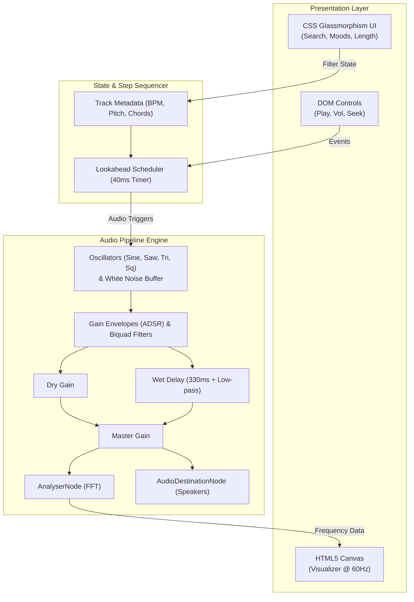

# ✦ Aurora — Free Music Synthesizer & Player

Aurora is a zero-dependency, lightweight web audio player and live algorithmic music generator built for short-form content creators (Reels, TikTok, and YouTube Shorts). It synthesizes full ambient, lo-fi, synthwave, drill, phonk, and pop tracks directly inside your browser using the native Web Audio API—complete with offline WAV rendering, custom audio uploads, and a reactive audio visualizer.


## ✨Live Demo ->  https://harshit4grahari.github.io/aurora-music/
---

## ✨ Features

- **Live In-Browser Synthesis**: Generates dynamic chord progressions, basslines, arpeggios, and multi-genre drum patterns directly in real-time using native `AudioContext` oscillators, noise buffers, and filters.
- **Creator-Ready Clip Lengths**: Seamlessly preview clips tailored for social media: 15s, 30s, 60s, or full length.
- **Instant WAV Export**: Renders procedural audio to 16-bit PCM `.wav` files via an `OfflineAudioContext` for instant download with zero server latency.
- **Audio File Upload & Drag-and-Drop**: Drop your own audio files (`.mp3`, `.wav`, `.m4a`, `.ogg`, `.flac`) directly into the window to play them through the visualizer.
- **Real-Time Visualizer**: Dynamic HTML5 `<canvas>` frequency visualizer that adapts to the theme of the current track.
- **Dynamic Theming**: Custom background gradient blobs and colors that morph to match each track's unique palette, paired with light/dark theme toggling.
- **Instant Search & Filter**: Filter tracks by mood, genre tags, and contextual search (e.g., "dance", "vlog", "gym", "chill).

---

## 🎵 Included Procedural Tracks

Aurora includes built-in procedural tracks across various genres and use cases:

| Track | Artist | Genre / Mood | Best For |
| :--- | :--- | :--- | :--- |
| **Main Character** | Kai Ora | Viral / Dance (128 BPM) | Dance trends |
| **Glow Up** | Sunday Static | Hype / Dance (124 BPM) | Transitions & glow-ups |
| **Night Drift** | Kai Ora | Phonk (132 BPM) | Car & attitude edits |
| **Trap Season** | Rehan & Co | Trap (140 BPM) | Gym & sports edits |
| **Midnight Rain** | Luna Vale | Lo-fi (76 BPM) | Study & relaxed b-roll |
| **Weekend Mode** | Sunday Static | Pop / Vlog (100 BPM) | Travel & daily vlogs |
| **Soft Diaries** | Hoshi | Vlog (82 BPM) | GRWM & aesthetic clips |
| **Wobble Walk** | Mellow Fox | Funny (112 BPM) | Memes & comedy sketches |
| **Epic Reveal** | Nerida | Cinematic (90 BPM) | Drone shots & travel reveals |

---

## 🏗 System Design & Architecture

Aurora is structured entirely around native client-side web primitives without relying on an external server or build pipeline. The architecture divides cleanly into three functional layers:
### 1. Step Sequencer & Scheduling
- **Lookahead Scheduling**: Uses an interval loop paired with `ctx.currentTime` to look 250ms ahead, pre-scheduling audio events to avoid UI-thread timing jitter and audio stutters.
- **Algorithmic Composition**: Tracks are represented by root MIDI notes, BPM, scale pitch offsets, and chord matrices. Arpeggios, baseline harmonies, and drum triggers (kick, snare, hi-hat) are computed deterministically per 8-step bar.

### 2. Audio Routing Graph
- **Dual Bus (Dry/Wet) Routing**: Audio signals split into a direct dry path and a filtered delay line (`DelayNode` at 330ms, feedback gain of 0.35, routed into a 2400Hz low-pass filter) to create space and reverb without external impulse response files.
- **Subtractive & Synthesized Drums**: Kicks use frequency pitch envelopes on a sine oscillator, while snares and hi-hats shape procedural white noise buffers through bandpass and highpass `BiquadFilterNode` instances.
- **Dual-Engine Playback**: Routes both algorithmic procedural tracks and imported media element audio files through the same master gain and analyzer nodes.

### 3. Client-Side Rendering & Export
- **Offline Rendering Engine**: Uses `OfflineAudioContext` running at 44.1kHz to render procedural steps into memory at high speeds without realtime playback waiting.
- **In-Memory Binary Serialization**: Converts raw PCM channel float data directly into an 8-bit/16-bit RIFF/WAVE file format via JavaScript `DataView` and `ArrayBuffer`.
- **PKZIP Packaging**: Assembles valid standard ZIP archives entirely in-memory using manual ZIP Local Header and Central Directory structures calculated with an internal CRC32 table.




---

## 🛠 Tech Stack

- **Audio Engine**: Native Web Audio API (`AudioContext`, `OfflineAudioContext`, `BiquadFilterNode`, `DelayNode`, `GainNode`, `OscillatorNode`, `AnalyserNode`)
- **Language**: Vanilla JavaScript (ES6+)
- **Markup & Layout**: Semantic HTML5 and modern CSS3 (CSS Custom Properties, Glassmorphism `backdrop-filter`, and CSS Animations)
- **Graphics / Rendering**: HTML5 Canvas API for real-time frequency spectrum visualization
- **Binary & Audio Encoding**: Raw binary manipulation with `ArrayBuffer` and `DataView` for client-side RIFF/WAVE header assembly and ZIP packaging
- **Zero External Dependencies**: Pure native browser APIs—no frameworks, libraries, build tools, or bundlers required.

---

## 🚀 Getting Started

Aurora is completely client-side and requires no setup or package installation

### Running Locally

1. Clone or download the repository:
   ```bash
   git clone (https://github.com/Harshit4grahari/aurora-music.git)
   cd aurora
